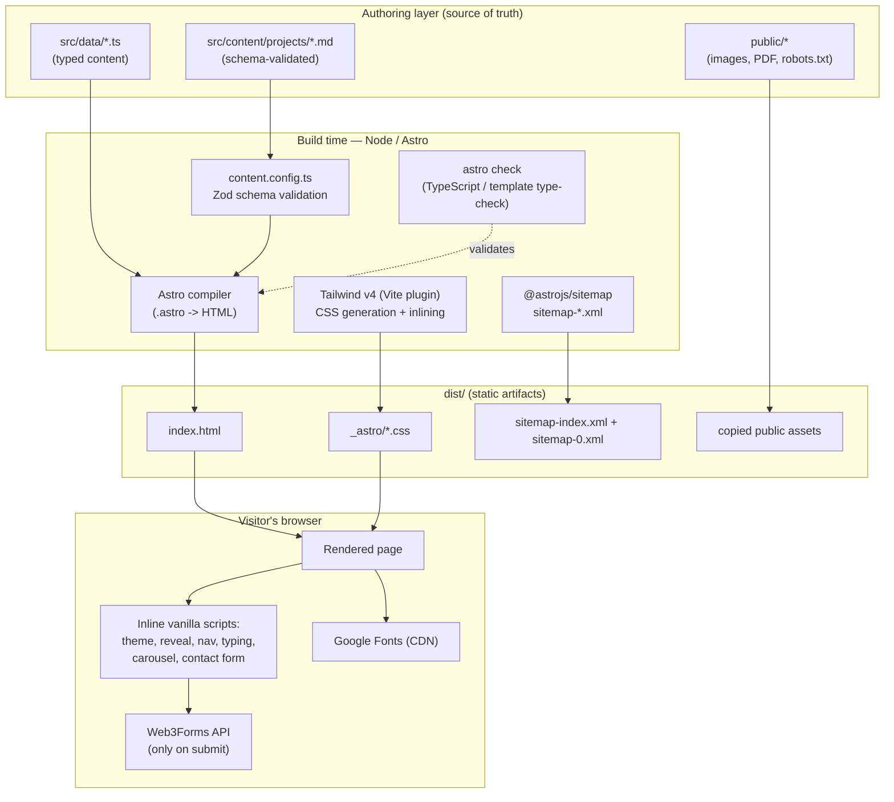
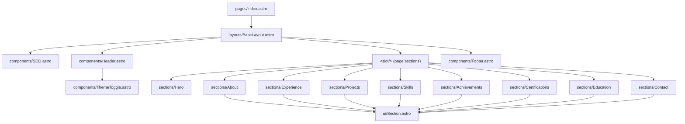

# 02 — Architecture, System Design & Data Flow

## High-level architecture

This is a **static site generator (SSG)** architecture. There is no application server at
runtime — everything is computed once at **build time** by Astro and emitted as static files into
`dist/`. The visitor's browser receives plain HTML + CSS plus a few tiny vanilla scripts.



### The two worlds: build-time vs. runtime

Understanding Astro requires separating these two execution contexts:

| | Build-time (Node) | Runtime (browser) |
| --- | --- | --- |
| **What runs** | Component frontmatter (the `---` fenced JS/TS at the top of each `.astro` file), `getCollection`, data imports, Zod validation | `<script is:inline>` blocks only |
| **When** | Once, during `astro dev`/`astro build` | On every page view |
| **Examples in this repo** | `Projects.astro:5` sorting the collection; `SEO.astro` computing JSON-LD; `Hero.astro:5-7` splitting the tagline | Theme toggle, scroll-reveal, carousel, contact `fetch()` |
| **Output** | HTML strings | DOM mutations / network calls |

Anything in component frontmatter is **gone by the time the page loads** — it leaves behind only
the HTML it produced. The only code that survives to the browser is the explicit `<script>` tags.

## System design

### Rendering model

- **Single route.** `src/pages/index.astro` is the only page; it maps to `/` → `dist/index.html`.
- **Page assembly.** `index.astro` imports nine section components and renders them inside
  `BaseLayout` in a fixed order (`src/pages/index.astro:14-24`). The section order *is* the page
  order — re-ordering sections is done here.
- **Layout shell.** `BaseLayout.astro` owns `<html>`, `<head>` (meta, fonts, theme bootstrap),
  the ambient background, skip link, `<Header>`, `<main><slot/></main>`, `<Footer>`, and the
  scroll-reveal script.
- **Section shell.** Most sections wrap their content in `ui/Section.astro`, which standardises
  the eyebrow + title + optional subtitle header and the `id` used for nav anchoring.



> Note: `Hero.astro` does **not** use `ui/Section.astro` — it is a bespoke full-height hero with
> its own `<section id="top">`. Every other content section does use it.

### Data flow

All content flows **one way**: authored data → consumed by components at build time → baked into
HTML. There is no runtime data fetching for content.

```mermaid
sequenceDiagram
    participant Dev as Author
    participant FS as Files (data/*.ts, content/*.md)
    participant Astro as Astro build
    participant Zod as Zod schema
    participant HTML as dist/index.html

    Dev->>FS: edit site.ts / experience.ts / *.md
    Astro->>FS: import data modules
    Astro->>FS: getCollection("projects")
    FS->>Zod: validate frontmatter
    Zod-->>Astro: typed, validated objects (or build error)
    Astro->>HTML: render sections to static HTML
    Note over HTML: Shipped as-is; no runtime fetch for content
```

Two distinct content channels feed the page:

1. **Typed TS data modules** (`src/data/*.ts`) — plain exported constants and types. Imported
   directly by sections (e.g. `Experience.astro:3` imports `experience`). Type-checked by
   `tsc`/`astro check`, but **not** runtime-validated.
2. **Content collection** (`src/content/projects/*.md`) — Markdown with YAML frontmatter,
   validated at build time against a **Zod schema** in `src/content.config.ts`. Accessed through
   the typed `getCollection("projects")` API (`Projects.astro:5`). A frontmatter field that
   violates the schema **fails the build**.

See [06 — Content & Data Models](./06-content-and-data-models.md) for the full schemas.

### Runtime (client) architecture

The page is interactive through **six independent, self-invoking inline scripts**. Each is an
IIFE with no shared global state and no module system — they communicate only through the DOM and
`localStorage`.

| Script | Lives in | Responsibility |
| ------ | -------- | -------------- |
| Theme bootstrap | `BaseLayout.astro:37-44` | Apply saved dark theme **before first paint** (no flash). |
| Theme toggle | `ThemeToggle.astro:16-24` | Toggle `.dark` class + persist to `localStorage`. |
| Scroll-reveal | `BaseLayout.astro:69-90` | `IntersectionObserver` adds `.is-visible` to `[data-reveal]`. |
| Header behaviour | `Header.astro:86-146` | Scroll styling, mobile menu, scroll-spy active link. |
| Hero typing | `Hero.astro:147-176` | Typewriter effect on the headline. |
| Certificates | `Certifications.astro:111-223` | Carousel paging + dots + lightbox modal. |
| Contact form | `Contact.astro:96-151` | Validate + AJAX POST to Web3Forms. |

All scripts are **progressive enhancements**: the page is fully readable with JavaScript disabled
(content is in the HTML; `[data-reveal]` falls back to visible — see
`global.css:143-159` reduced-motion handling and `BaseLayout.astro:73-76` no-`IntersectionObserver`
fallback).

See [09 — Client-Side Behaviour](./09-client-side-behavior.md) for line-by-line detail.

## Architectural decisions & rationale (ADRs in brief)

| Decision | Rationale | Trade-off |
| -------- | --------- | --------- |
| **Astro static output, no SSR adapter** | Cheapest, fastest, most cacheable hosting; nothing dynamic is needed. | No server-side logic; the contact form must use a third-party service. |
| **No client UI framework** | A portfolio's interactivity is trivial; vanilla scripts keep the JS payload near-zero. | More verbose imperative DOM code; no component reuse for interactive bits. |
| **Content split: typed TS + Markdown collection** | TS data for structured lists; Markdown collection for richer, schema-validated project entries with prose bodies. | Two mental models for "content". |
| **`is:inline` scripts** | Tiny, run immediately, avoid bundler overhead and module boot cost. | No TypeScript checking or bundling of those scripts; duplication possible. |
| **Web3Forms for contact** | Keeps the site backend-free while still accepting messages. | Depends on a third party; access key is public (see [12](./12-security.md)). |
| **Tailwind v4 via Vite plugin** | First-class Vite integration, CSS-first config via `@theme`. | Newer/major version with fewer community examples than v3. |

## Failure & resilience characteristics

- **Build fails fast** if project frontmatter violates the Zod schema or if `astro check` finds a
  type error — both run before any `dist/` is produced.
- **Runtime is highly resilient**: every script guards its DOM lookups (`if (!el) return`),
  the hero image has an `onerror` fallback to initials (`Hero.astro:28`), and the contact form
  catches network errors (`Contact.astro:144`).
- **No single point of runtime failure** for content — it's all static HTML. The only runtime
  external dependencies are Google Fonts (degrades to system fonts via `display=swap`) and
  Web3Forms (only touched when a user submits the form).
