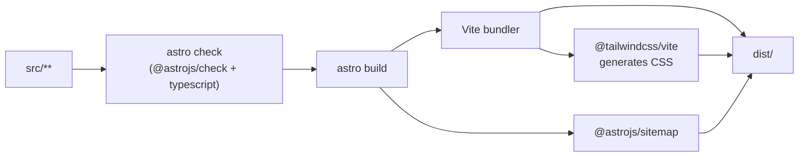

# 03 — Technology Stack & Dependencies

## Overview

| Concern | Choice | Where configured |
| ------- | ------ | ---------------- |
| Framework / SSG | **Astro 5** (static output) | `astro.config.mjs` |
| Language | **TypeScript** (strict) | `tsconfig.json` |
| Styling | **Tailwind CSS v4** (via `@tailwindcss/vite`) | `src/styles/global.css`, `astro.config.mjs:14-17` |
| Content | Astro **Content Collections** | `src/content.config.ts` |
| Validation | **Zod** (bundled via `astro:content`) | `src/content.config.ts` |
| Contact form | **Web3Forms** (third-party, no backend) | `src/components/sections/Contact.astro` |
| SEO | Meta + OpenGraph + Twitter + JSON-LD + **`@astrojs/sitemap`** | `src/components/SEO.astro`, `astro.config.mjs:9` |
| Fonts | **Sora** (display) · **Inter** (body) · **JetBrains Mono** (code), via Google Fonts | `src/layouts/BaseLayout.astro:26-32`, tokens in `global.css:12-14` |
| Build bundler | **Vite** (bundled inside Astro) | implicit |

## Dependencies (from `package.json`)

This project keeps **all packages under `dependencies`** (there is no `devDependencies` block).
For a static site this is harmless — nothing is shipped to the client from `node_modules`; the
distinction only matters conceptually.

| Package | Declared range | Role |
| ------- | -------------- | ---- |
| `astro` | `^5.1.1` | The framework/SSG. Compiles `.astro` files, runs the dev server, builds `dist/`. |
| `@astrojs/check` | `^0.9.4` | Provides `astro check` — type-checks `.astro` templates + TS. Invoked by `npm run build`. |
| `@astrojs/sitemap` | `^3.2.1` | Integration that emits `sitemap-index.xml` / `sitemap-0.xml` at build. |
| `@tailwindcss/vite` | `^4.0.0` | Tailwind v4's official Vite plugin (Tailwind v4 is configured in CSS, not a JS config file). |
| `tailwindcss` | `^4.0.0` | The Tailwind engine itself. |
| `typescript` | `^5.7.2` | The TypeScript compiler (used by `astro check`). |

> There is no `devDependencies` section, no linter (ESLint), no formatter (Prettier), and no test
> runner declared. See [15 — Testing](./15-testing.md) and
> [Issues & Recommendations](./issues-and-recommendations.md).

## NPM scripts (`package.json:6-11`)

| Script | Command | Purpose |
| ------ | ------- | ------- |
| `dev` | `astro dev` | Start the local dev server (HMR) at `http://localhost:4321`. |
| `start` | `astro dev` | Alias of `dev`. |
| `build` | `astro check && astro build` | **Type-check, then** build static output to `dist/`. The `&&` means a type error blocks the build. |
| `preview` | `astro preview` | Serve the built `dist/` locally to verify the production output. |
| `astro` | `astro` | Pass-through to the Astro CLI (e.g. `npm run astro -- add ...`). |

## The toolchain, step by step



## Language & type configuration

- **`tsconfig.json`** extends `astro/tsconfigs/strict` — Astro's strict preset (strict null
  checks, no implicit any, etc.).
- It **includes** `.astro/types.d.ts` (generated content/collection types) and `**/*`, and
  **excludes** `dist`.
- A path alias is defined: `@/*` → `./src/*` (`tsconfig.json:7-9`). This is why imports look like
  `@/components/SEO.astro` and `@/data/site`.

```jsonc
// tsconfig.json
{
  "extends": "astro/tsconfigs/strict",
  "include": [".astro/types.d.ts", "**/*"],
  "exclude": ["dist"],
  "compilerOptions": { "paths": { "@/*": ["./src/*"] } }
}
```

## Astro configuration (`astro.config.mjs`)

```js
export default defineConfig({
  site: "https://portfolio.akashgaur.workers.dev",        // canonical/site URL (used by SEO + sitemap)
  integrations: [sitemap()],            // emits sitemap files
  vite: { plugins: [tailwindcss()] },   // Tailwind v4 as a Vite plugin
  build: { inlineStylesheets: "auto" }, // inline small CSS into HTML; link large CSS
});
```

- `site` feeds canonical URLs in `SEO.astro:16-17` and the sitemap. **Must be updated to the real
  production domain before deploy.**
- `inlineStylesheets: "auto"` lets Astro inline small stylesheets directly into the HTML `<head>`
  (fewer round-trips) and externalise larger ones.
- The `@type {any}` cast on `tailwindcss()` (`astro.config.mjs:15`) sidesteps a Vite version type
  clash between `@tailwindcss/vite` and Astro's bundled Vite — see the inline comment.

## Runtime/browser dependencies (not npm packages)

These are loaded by the browser, not bundled:

| Dependency | How loaded | Failure behaviour |
| ---------- | ---------- | ----------------- |
| **Google Fonts** (Inter, Sora, JetBrains Mono) | `<link rel="stylesheet">` with `display=swap` (`BaseLayout.astro:29-32`) | Falls back to system fonts; text remains visible during load. |
| **Web3Forms API** (`https://api.web3forms.com/submit`) | `fetch()` POST on contact form submit (`Contact.astro:125`) | Caught; user sees an error status message. |

## Version / compatibility notes

- **Node.js**: Astro 5 requires Node 18.20.8+, 20.3.0+, or 22+. No `engines` field is declared in
  `package.json`, and there is no `.nvmrc` — see [Issues & Recommendations](./issues-and-recommendations.md).
- **Tailwind v4** is a major rewrite from v3: there is **no `tailwind.config.js`**; configuration
  is CSS-first via `@theme` and `@custom-variant` directives in `global.css`. Don't look for a JS
  config — there isn't one.
- A `package-lock.json` is committed, pinning the full dependency tree for reproducible installs.
