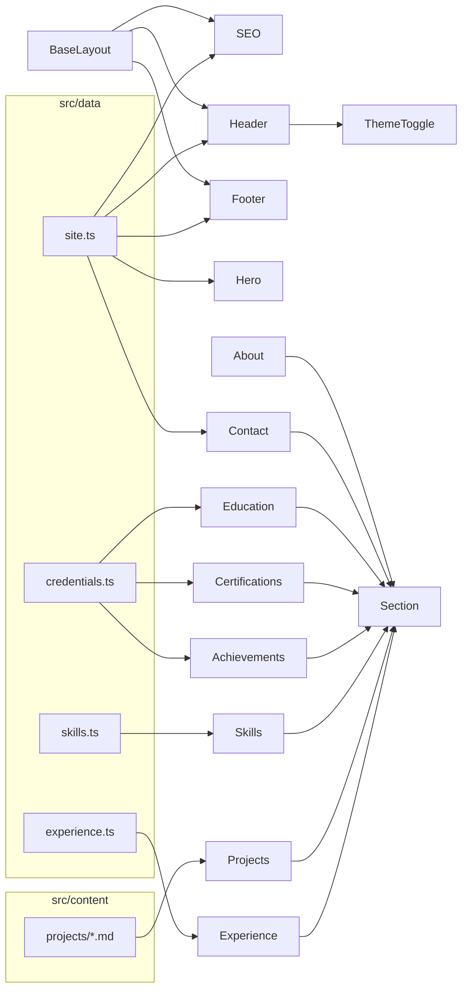

# 05 — Core Modules & Components

Every UI building block is an Astro component (`.astro`). An Astro component has two parts:
**frontmatter** (the `---` fenced script, runs at build time) and **template** (the HTML-like
markup). Some also include `<script>` (ships to the browser) and `<style>` (scoped CSS).

This page documents each component: its props, what it renders, and its relationships.

---

## Layout & shell

### `layouts/BaseLayout.astro`
The document shell wrapping every page.

- **Props** (`BaseLayout.astro:7-11`): `title?`, `description?`, `image?` — all optional, all
  forwarded to `<SEO>`.
- **Responsibilities:**
  - Emits `<!doctype html>`, `<html lang="en">`, full `<head>`.
  - Loads Google Fonts with `preconnect` + `display=swap` (`:26-32`).
  - Renders `<SEO>` (`:34`).
  - **Theme bootstrap** inline script that adds `.dark` before paint if `localStorage.theme ===
    "dark"` (`:37-44`) — prevents a flash of the wrong theme.
  - Renders the ambient background glow, the skip-to-content link, `<Header>`,
    `<main id="main"><slot/></main>`, `<Footer>`.
  - **Scroll-reveal** inline script using `IntersectionObserver` (`:69-90`).
- **Consumed by:** `pages/index.astro:14`.

### `components/SEO.astro`
All `<head>` SEO/meta output. See [13 — SEO](./13-seo-accessibility-performance.md) for the full
tag inventory.

- **Props** (`SEO.astro:4-8`): `title?`, `description?`, `image?`. Defaults derive from
  `site` data: title = `"${site.name} — ${site.title}"`, description = `site.summary`,
  image = `site.ogImage` (`:10-14`).
- **Build-time logic:** computes a canonical URL and an absolute OG image URL from `Astro.site`
  (falling back to `site.url`) (`:16-17`); builds two JSON-LD objects (`Person`, `WebSite`).
- **Renders:** `<title>`, description, canonical link, author, robots; Open Graph tags; Twitter
  card tags; two `<script type="application/ld+json">` blocks.

### `components/Header.astro`
Sticky top navigation.

- **Imports:** `site`, `navLinks` from `@/data/site`; `<ThemeToggle>`.
- **Renders:** logo/wordmark, desktop nav (mapped from `navLinks`), résumé download button,
  `<ThemeToggle>`, hamburger button, and a separate mobile nav panel.
- **Client script** (`:86-146`): three concerns — (1) toggle header styling once scrolled past
  16px; (2) open/close mobile menu with ARIA + icon swap; (3) **scroll-spy** via
  `IntersectionObserver` that highlights the active nav link. See
  [09 — Client-Side Behaviour](./09-client-side-behavior.md).

### `components/Footer.astro`
Site footer.

- **Imports:** `site`, `socials`, `navLinks`.
- **Build-time:** `const year = new Date().getFullYear()` (`:3`) — the copyright year is the
  **build year**, not the visitor's current year.
- **Renders:** wordmark, tagline, social icon links, a "Navigate" link list, copyright line, and a
  "Built with Astro & Tailwind" credit.

### `components/ThemeToggle.astro`
Dark/light toggle button.

- **Props:** none.
- **Renders:** a button containing a sun icon (shown in light mode) and a moon icon (shown in dark
  mode), switched purely with the `dark:` variant.
- **Client script** (`:16-24`): on click, toggles `.dark` on `<html>` and writes `theme` to
  `localStorage`.

---

## Section shell

### `components/ui/Section.astro`
The reusable wrapper that gives every content section a consistent header and anchor.

- **Props** (`Section.astro:2-9`): `id` (required — the anchor target for nav), `eyebrow`
  (required label), `title` (required heading), `subtitle?`, `class?` (extra section classes),
  `headerClass?` (defaults to `"mb-12"`).
- **Renders:** `<section id scroll-mt-24 py-20…>` → `.container-page` → a `[data-reveal]` header
  with eyebrow + `<h2>` + optional subtitle → `<slot/>` for the section body.
- **Used by:** every section component **except `Hero`** (About, Experience, Projects, Skills,
  Achievements, Certifications, Education, Contact).

---

## Page sections (`components/sections/`)

All section components are pure presentational templates that map over data. None take props;
each imports its own data.

### `Hero.astro`
- **Data:** `site`, `socials`.
- **Build-time transform** (`:5-7`): splits `site.tagline` into a bold lead phrase, the rest, and
  a separate "Passionate about…" sentence — purely for visual emphasis.
- **Renders:** availability pill, animated headline (`Hi, I'm <name>` with a blinking cursor),
  tagline, "View my work" / "Get in touch" CTAs, social links, and the profile portrait inside a
  rotating gradient ring.
- **Image fallback** (`:28`): `onerror` hides the `` and shows an "AG" initials block.
- **Scoped `<style>`** (`:106-145`): cursor blink, ring shift animation, reduced-motion overrides.
- **Client script** (`:147-176`): the typewriter effect (skipped under `prefers-reduced-motion`).

### `About.astro`
- **Data:** a local `focus` string array (`:4-17`) — *defined inline in the component*, not in
  `data/`.
- **Renders:** four bio paragraphs (static prose) + a "Focus areas" list mapped from `focus`.

### `Experience.astro`
- **Data:** `experience` (`Role[]`) from `@/data/experience`.
- **Renders:** a vertical timeline; per role: role/company header, a "Current" chip when
  `job.current`, period, optional blurb, then highlight cards (title + bullet points + tech chips).

### `Projects.astro`
- **Data:** `getCollection("projects")`, **sorted ascending by `order`** (`:5`).
- **Renders:** a 2-column grid of project cards. `featured` projects span both columns
  (`lg:col-span-2`, `:23`). Each card shows tags, title, tagline, conditional repo/UI/demo links,
  a Problem/Architecture split panel, a collapsible `
` "Key achievements" list, and a
  tech-chip footer.
- **Notable:** staggered reveal via `style={--reveal-delay: ${i*60}ms}` (`:26`); the GitHub icon
  path is inlined as a const (`:7-8`).

### `Skills.astro`
- **Data:** `skillGroups` from `@/data/skills`.
- **Renders:** a responsive grid of skill cards, each with an icon (from the shared `ICONS` map in
  `skills.ts`), category name, and chips for each skill.
- **Note:** the `id` (`genai`, `backend`, …) on each group is described as a "filter id" but **no
  filtering UI is implemented** — see [Issues & Recommendations](./issues-and-recommendations.md).

### `Achievements.astro`
- **Data:** `achievements` from `@/data/credentials`.
- **Build-time:** a local `kindMeta` map (`:5-10`) maps each achievement `kind`
  (`award`/`research`/`hackathon`/`exam`) to a label + icon path.
- **Renders:** cards with a kind-specific icon, title, year chip, and detail text.

### `Certifications.astro`
- **Data:** `certifications` from `@/data/credentials`.
- **Renders:** a horizontal track of certificate cards (responsive widths for 1/2/3 per view),
  prev/next controls, a dots indicator, and a full-screen lightbox dialog.
- **Two client scripts:** (1) the carousel engine — paging math, dot building, transform-based
  sliding, resize handling (`:111-185`); (2) the lightbox — open/close, body-scroll lock,
  Escape-to-close, click-outside-to-close (`:187-223`). See
  [09 — Client-Side Behaviour](./09-client-side-behavior.md).

### `Education.astro`
- **Data:** `education` from `@/data/credentials`.
- **Renders:** cards with the institution logo, credential, institution name, a score chip, and
  the period.

### `Contact.astro`
- **Data:** `site` (for `web3formsKey` and `availability`).
- **Renders:** a headline column + a contact form with a hidden honeypot (`botcheck`), name/email/
  message fields, a submit button, and a status line.
- **Client script** (`:96-151`): validates, POSTs JSON to Web3Forms, and updates the status.
  The access key is passed in via `define:vars` (`:96`). See
  [10 — External Integrations](./10-external-integrations.md) and [12 — Security](./12-security.md).

---

## Component relationship summary

## Conventions shared across components

- **No props on sections.** Each section is self-contained and pulls its own data — this keeps
  `index.astro` a clean ordered list.
- **`data-reveal`** marks any element that should animate in on scroll; `--reveal-delay` staggers
  siblings.
- **Reusable utility classes** (`.card`, `.chip`, `.btn-primary`, `.btn-ghost`,
  `.section-eyebrow`, `.container-page`, `.text-gradient`) come from `global.css` — see
  [08 — Styling](./08-styling-design-system.md).
- **Icons are inline SVG path strings**, often stored in data (`socials[].icon`,
  `skills.ICONS`, `kindMeta`) and rendered into a shared `<svg>` wrapper.
