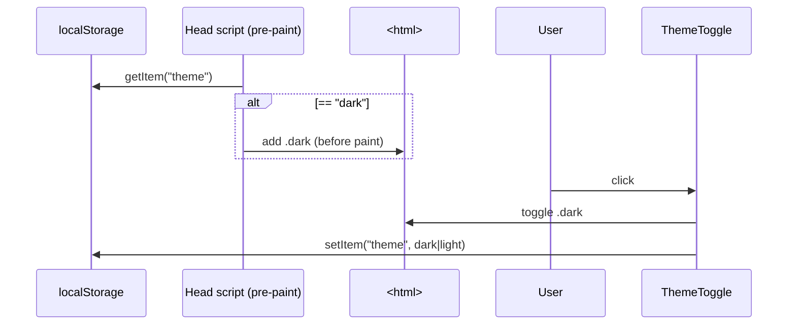
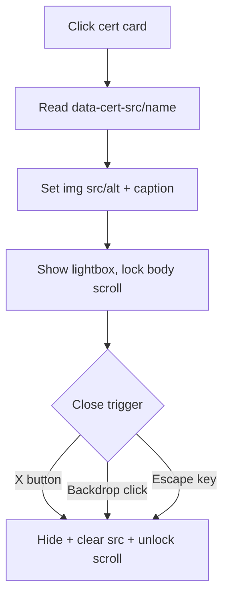
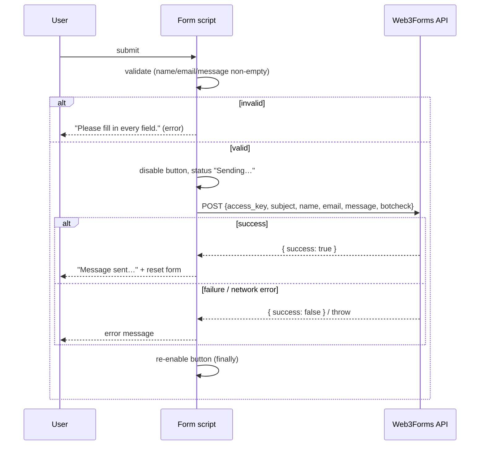

# 09 — Client-Side Behaviour & Interactivity

All interactivity ships as **`<script is:inline>` IIFEs** — small, framework-free, immediately
invoked. `is:inline` tells Astro to leave the script untouched (no bundling, no processing) and
emit it inline in the HTML. There is no shared module state; scripts coordinate only through the
DOM, `localStorage`, and CSS classes.

A guiding principle across all of them: **defensive, progressive enhancement.** Each script
null-checks its DOM targets and returns early if absent, and the page remains fully usable if a
script never runs.

---

## 1. Theme: set-before-paint + toggle

### Bootstrap (`BaseLayout.astro:37-44`)
Runs in `<head>` **before the body renders** to avoid a flash-of-wrong-theme:

```js
if (localStorage.getItem("theme") === "dark") {
  document.documentElement.classList.add("dark");
}
```
Light is the default; dark is opt-in and only applied if explicitly stored.

### Toggle (`ThemeToggle.astro:16-24`)
```js
btn?.addEventListener("click", () => {
  const isDark = document.documentElement.classList.toggle("dark");
  localStorage.setItem("theme", isDark ? "dark" : "light");
});
```
The sun/moon icons swap purely via the `dark:` CSS variant — no JS needed for the icon switch.



> Note: there is **no `storage` event listener**, so two open tabs won't sync theme live; and the
> bootstrap reads only `"dark"`, ignoring OS `prefers-color-scheme` for the initial value (light
> is forced unless the user previously chose dark). See [Issues & Recommendations](./issues-and-recommendations.md).

---

## 2. Scroll-reveal (`BaseLayout.astro:69-90`)

Animates `[data-reveal]` elements into view.

- **Bails out** entirely under `prefers-reduced-motion: reduce` (content already visible via CSS).
- **Fallback**: if `IntersectionObserver` is unsupported, all elements get `.is-visible`
  immediately.
- Otherwise an observer (`rootMargin: "0px 0px -10% 0px"`, `threshold: 0.1`) adds `.is-visible`
  when an element enters the viewport and then `unobserve`s it (one-shot).

---

## 3. Header behaviour (`Header.astro:86-146`)

Three concerns in one script:

1. **Scroll styling** (`:88-101`): when `window.scrollY > 16`, toggles a set of classes on
   `#header-inner` (border, translucent background, blur, shadow) so the header gains a "card"
   look once scrolled. Runs once on load and on every `scroll` (passive listener).
2. **Mobile menu** (`:104-119`): the hamburger toggles the `#mobile-nav` panel's `hidden` class,
   updates `aria-expanded`, and swaps the open/close icons. Clicking any mobile link closes it.
3. **Scroll-spy** (`:121-145`): an `IntersectionObserver` (`rootMargin: "-45% 0px -50% 0px"` — a
   thin band across the viewport middle) highlights the nav link whose section is currently
   centred, by toggling `text-brand-600 dark:text-brand-300`.

> The spy maps `nav-link` `href="#id"` → section `#id`. This is why **`navLinks` ids must match
> section ids** (`site.ts` ↔ section `id`s).

---

## 4. Hero typing effect (`Hero.astro:147-176`)

A typewriter that types the prefix ("Hi, I'm ") then the name, then hides the blinking cursor.

- **Bails out** under `prefers-reduced-motion: reduce` (the full text is already in the DOM, so
  nothing is lost).
- Captures each target's full text, clears it, then reveals characters every 95ms; after the last
  character, fades the cursor out after 600ms.
- The cursor itself is a CSS animation (`Hero.astro:107-117`).

---

## 5. Certificate carousel + lightbox (`Certifications.astro:111-223`)

Two scripts.

### Carousel engine (`:111-185`)
- **Responsive `perView`**: 3 (≥1024px), 2 (≥640px), else 1 (`:122-123`).
- **`maxIndex`** = `cards.length - perView()` (`:124`).
- **Dots** are built dynamically (`:126-143`), one per page position; clicking a dot jumps there.
- **`update()`** (`:145-161`): clamps the index (wrapping past either end), measures card width +
  gap, and applies a `translateX` transform to slide the track. Updates the active dot styling.
- **Prev/Next** buttons decrement/increment the index (`:163-170`).
- **Resize**: debounced (150ms) rebuild of dots + re-clamp + `update()` (`:172-180`).

### Lightbox (`:187-223`)
- Clicking a `.cert-card` reads its `data-cert-src`/`data-cert-name` and opens the modal,
  **locking body scroll** (`document.body.style.overflow = "hidden"`).
- Closes via the close button, clicking the backdrop, or pressing **Escape**; restores body
  scroll.



> A11y note: the lightbox sets `role="dialog"`/`aria-modal` but does **not** trap focus or restore
> focus to the trigger on close — see [Issues & Recommendations](./issues-and-recommendations.md).

---

## 6. Contact form (`Contact.astro:96-151`)

AJAX submission to Web3Forms (full contract in [10 — External Integrations](./10-external-integrations.md)).

- The access key is injected via Astro's **`define:vars`** (`:96`), exposing `accessKey` to the
  inline script.
- On submit: `preventDefault`, read+trim `name`/`email`/`message`.
- **Client validation** (`:116-119`): all three required; otherwise show an error and stop. (Note
  the form uses `novalidate`, so native browser validation is disabled in favour of this.)
- Disables the button, shows "Sending…", `fetch` POSTs JSON to `https://api.web3forms.com/submit`.
- On `result.success` → success message + `form.reset()`; otherwise an error message.
- `catch` handles network errors; `finally` re-enables the button.
- **Honeypot**: the hidden `botcheck` checkbox is forwarded; bots that tick it are filtered by
  Web3Forms.



---

## Cross-cutting patterns

| Pattern | Where | Why |
| ------- | ----- | --- |
| IIFE + `is:inline` | every script | Isolation, immediate run, no bundler. |
| Null-guarded DOM access (`el?.`, `if (!el) return`) | all | Resilience if markup changes. |
| `prefers-reduced-motion` bail-out | reveal, hero typing | Accessibility. |
| `IntersectionObserver` | reveal, scroll-spy | Efficient viewport detection (no scroll-thrash). |
| `localStorage` | theme | Persist user preference. |
| Debounced resize | carousel | Avoid layout thrash. |

> Because these scripts are not TypeScript-checked or bundled, shared icon strings and idioms are
> duplicated across files (e.g. the GitHub icon path appears in both `site.ts` and
> `Projects.astro`). Tracked in [Issues & Recommendations](./issues-and-recommendations.md).
