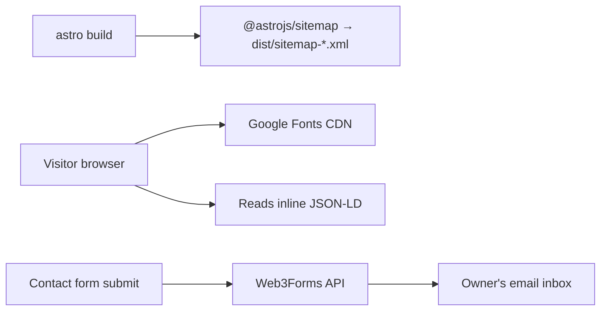

# 10 — External Integrations & Services

The site is backend-free, but it touches a few external services — at **build time** and at
**runtime**.

| Integration | Type | When | Direction |
| ----------- | ---- | ---- | --------- |
| `@astrojs/sitemap` | Build-time integration | `astro build` | Internal (emits files) |
| Google Fonts | Runtime CDN | Every page load | Inbound CSS/font files |
| Web3Forms | Runtime API | Contact form submit only | Outbound POST |
| Schema.org (JSON-LD) | Static metadata | Build-time output | Consumed by search engines |

---

## 1. Web3Forms (contact form backend-as-a-service)

Because there is no server, the contact form delegates email delivery to **Web3Forms**.

- **Endpoint:** `POST https://api.web3forms.com/submit` (`Contact.astro:125`).
- **Auth:** an `access_key` field identifying the receiving inbox.
  - Key: `site.web3formsKey` = `3662caf2-3420-47fe-b67d-deff74e312b4` (`site.ts:16`).
  - Passed to the client script via `define:vars={{ accessKey: site.web3formsKey }}` (`:96`).
  - **This key is public by design** — it only routes to an inbox and cannot read data. See
    [12 — Security](./12-security.md).

### Request contract (`Contact.astro:125-136`)
```jsonc
POST https://api.web3forms.com/submit
Content-Type: application/json
Accept: application/json

{
  "access_key": "<web3formsKey>",
  "subject":    "Portfolio enquiry from <name>",
  "name":       "<name>",
  "email":      "<email>",
  "message":    "<message>",
  "botcheck":   <honeypot value>
}
```

### Response contract
```jsonc
{ "success": true | false, /* …other fields… */ }
```
The script branches solely on `result.success` (`:138`).

### Anti-spam
A hidden `botcheck` checkbox (`Contact.astro:31-38`) is the **honeypot**: invisible to humans
(`display:none`, `tabindex="-1"`), so any submission where it's filled is flagged as a bot by
Web3Forms.

### Failure handling
- Non-success response → "Something went wrong. Please try again later." (`:141`)
- Network throw → "Network error. Please try again later." (`:144`)
- Button re-enabled in `finally` (`:147`) so the user can retry.

### Operational dependency
If Web3Forms is down, rate-limits, or the key is revoked, the form silently fails to deliver
(user sees the error message; no fallback channel). The site's `mailto:` social link
(`socials[3]`, `site.ts:46`) is the backup contact path.

---

## 2. Google Fonts

Loaded in `BaseLayout.astro:26-32`:

```html
<link rel="preconnect" href="https://fonts.googleapis.com" />
<link rel="preconnect" href="https://fonts.gstatic.com" crossorigin />
<link rel="stylesheet" href="https://fonts.googleapis.com/css2?family=Inter:wght@400;500;600;700&family=Sora:wght@500;600;700;800&family=JetBrains+Mono:wght@400;500&display=swap" />
```

- **Families:** Inter (400–700), Sora (500–800), JetBrains Mono (400–500). These match the
  `--font-*` tokens in `global.css`.
- **`preconnect`** warms the TLS connections to the two font hosts for faster fetches.
- **`display=swap`** shows fallback (system) fonts immediately, swapping to the web fonts when
  ready — no invisible-text delay.
- **Privacy/perf note:** this is a third-party runtime dependency (a request to Google on every
  load). Self-hosting the fonts (e.g. via `@fontsource`) would remove the external dependency and
  the privacy consideration. See [Issues & Recommendations](./issues-and-recommendations.md).

---

## 3. `@astrojs/sitemap` (build-time)

Registered in `astro.config.mjs:9` (`integrations: [sitemap()]`).

- At build, emits `dist/sitemap-index.xml` + `dist/sitemap-0.xml`, using `site` as the base URL.
- `public/robots.txt` advertises it: `Sitemap: https://portfolio.akashgaur.workers.dev/sitemap-index.xml`.
- Because there's a single route, the sitemap lists `/`. **The `site` URL must be correct** for
  the emitted URLs (and robots pointer) to be valid.

---

## 4. Structured data (Schema.org JSON-LD)

`SEO.astro:19-41` builds two JSON-LD objects, serialised into `<script type="application/ld+json">`:

- **`Person`** — name, job title, email, URL, address, `alumniOf` (MITS), `worksFor` (Kloudspot),
  `knowsAbout` (GenAI/LangGraph/RAG/…), and `sameAs` (all socials except Email).
- **`WebSite`** — site name + URL.

This is consumed by search engines/social platforms for rich results; it's not a runtime
integration but an outbound metadata contract.

---

## Integration dependency map



## Summary of external trust boundaries

| Boundary | Data shared | Risk if compromised |
| -------- | ----------- | ------------------- |
| Google Fonts | Visitor IP/UA on font fetch | Low (privacy only); degrades gracefully. |
| Web3Forms | Submitted name/email/message | Spam to inbox / delivery loss; no data store on the site. |
| Search engines (JSON-LD) | Public profile data (already public) | None. |
