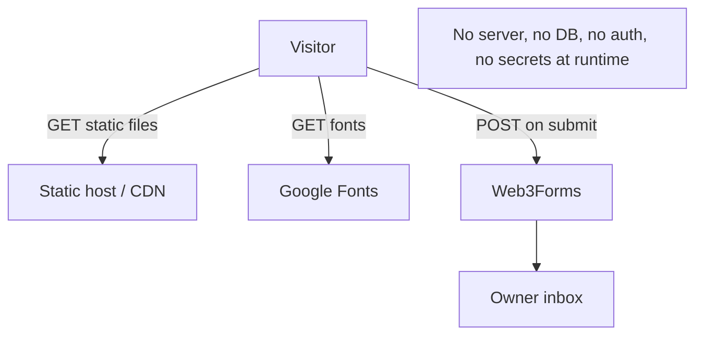

# 12 — Security Considerations

## Authentication & authorization

**There is none, and none is needed.** The site has no user accounts, no login, no sessions, no
protected routes, and no server. Every route is public, static, read-only content. This section
therefore focuses on the *actual* attack surface of a static, third-party-form-backed site.

## Trust boundaries & attack surface

| Surface | Exposure | Risk level |
| ------- | -------- | ---------- |
| Static files on host | Public read | Low (nothing sensitive) |
| Contact form → Web3Forms | Public POST | Medium (spam / abuse) |
| Google Fonts | Visitor metadata to Google | Low (privacy) |
| Hard-coded Web3Forms key | Visible in source | By design — not a secret |
| Personal data in source/JSON-LD | Public | Intentional (it's a portfolio) |

## The Web3Forms access key

- Location: `src/data/site.ts:16`, also emitted into client HTML via `define:vars`.
- **It is public by design.** The inline comment (`site.ts:14-15`) and README both state this: the
  key only identifies *which inbox* receives a submission; it grants no read access and exposes no
  data. Anyone viewing source can see it — that is expected for Web3Forms' model.
- **Residual risk:** a third party could POST to the same key (spam your inbox) or you could hit
  Web3Forms' rate/usage limits. Mitigations: the honeypot, plus Web3Forms' own server-side spam
  filtering and (optionally) hCaptcha, which is **not** currently enabled.

## Contact form security posture

| Control | Status | Notes |
| ------- | ------ | ----- |
| Honeypot (`botcheck`) | ✅ Present (`Contact.astro:31-38`) | Hidden field; bots that fill it are rejected. |
| CAPTCHA / hCaptcha | ❌ Not enabled | Web3Forms supports it; would harden against bots. |
| Client-side validation | ✅ Basic (`:116-119`) | Non-empty name/email/message. `novalidate` disables native validation. |
| Server-side validation | n/a (delegated) | Web3Forms handles delivery + filtering. |
| Rate limiting | ❌ None on the client | Relies on Web3Forms. |
| Email format validation | ⚠️ Weak | `type="email"` exists but `novalidate` + only a non-empty check in JS. |

## XSS / injection

- **Low risk.** All content is author-controlled and rendered through Astro's templating, which
  HTML-escapes interpolated values by default. There is no user-generated content displayed on the
  page.
- **`set:html` usage:** `SEO.astro:65-66` uses `set:html={JSON.stringify(...)}` for JSON-LD. The
  input is static, author-controlled objects, so this is safe — but `set:html` bypasses escaping,
  so never feed it untrusted/dynamic data.
- The contact form's values are sent to Web3Forms, never reflected back into the DOM, so there's no
  reflection-XSS vector on the site itself.

## Outbound link safety

External links that open in a new tab use `target="_blank" rel="noopener noreferrer"`
(e.g. `Footer.astro:18-19`, `Hero.astro:89-90`, project links in `Projects.astro`). This prevents
reverse-tabnabbing and referrer leakage. ✅

## HTTP security headers

These are a **host concern**, not set by the app (a static site can't set response headers itself).
Recommended to configure at the CDN/host:

| Header | Recommended value | Purpose |
| ------ | ----------------- | ------- |
| `Content-Security-Policy` | restrict to `self` + `fonts.googleapis.com`/`fonts.gstatic.com` + `api.web3forms.com` | Mitigate XSS / unexpected loads. |
| `Strict-Transport-Security` | `max-age=63072000; includeSubDomains; preload` | Force HTTPS. |
| `X-Content-Type-Options` | `nosniff` | Prevent MIME sniffing. |
| `Referrer-Policy` | `strict-origin-when-cross-origin` | Limit referrer leakage. |
| `Permissions-Policy` | lock down camera/mic/geolocation | Least privilege. |

> A CSP would need to allow the inline scripts (they're `is:inline`), which complicates a strict
> policy — either hash/nonce them or accept `'unsafe-inline'` for scripts. See
> [Issues & Recommendations](./issues-and-recommendations.md).

## Personal data exposure

Email, location, social handles, education, and employer are intentionally published (it's a
portfolio) and duplicated into JSON-LD. The **phone number is masked** (`+91 xxxxxxxxxx`,
`site.ts:11`) and not rendered. This is appropriate; just be aware that email in `mailto:` +
JSON-LD is scrapeable.

## Dependency / supply-chain security

- A committed `package-lock.json` pins the dependency tree (reproducible installs).
- No automated vulnerability scanning is configured (no Dependabot/`npm audit` in CI). Recommended
  — see [14 — CI/CD](./14-build-deployment-cicd.md) and
  [Issues & Recommendations](./issues-and-recommendations.md).
- Because nothing from `node_modules` ships to the client, a vulnerable transitive dependency
  generally only affects the *build* environment, not visitors — lower blast radius than an app
  that bundles deps to the browser.

## Security summary

The static architecture eliminates whole classes of vulnerabilities (no SQLi, no auth bypass, no
server RCE, no session hijacking). The realistic concerns are: **contact-form abuse/spam**,
**missing HTTP security headers (host-side)**, and **third-party runtime dependencies** (fonts).
None are critical for a personal portfolio, but the header configuration and optional CAPTCHA are
easy, worthwhile hardening steps.
