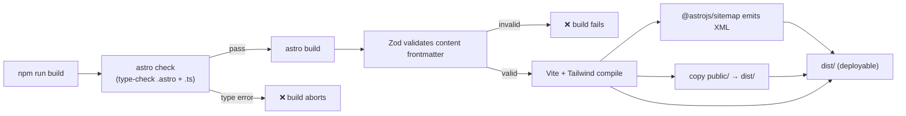

# 14 — Build, Deployment & CI/CD

## The build pipeline

```bash
npm run build   # => astro check && astro build
```

Two sequential steps (the `&&` means step 2 only runs if step 1 passes):



1. **`astro check`** — runs the TypeScript/`.astro` type-checker (`@astrojs/check` + `typescript`).
   Catches type errors in frontmatter, data files, and templates.
2. **`astro build`** — validates content collections (Zod), compiles components to HTML, runs Vite
   + the Tailwind plugin to generate CSS, runs the sitemap integration, and copies `public/`.

**Output:** `dist/` — a self-contained static bundle (see
[04 — Directory Structure](./04-directory-structure.md#dist--build-output-git-ignored)).

### Local verification of the production build
```bash
npm run preview   # serves dist/ at http://localhost:4321
```
Always preview before deploying — `astro dev` and the built output can differ (e.g. inlining,
asset hashing).

## Deployment targets

The site is plain static files, so any static host works. Build command and publish directory are
universal:

| Setting | Value |
| ------- | ----- |
| Build command | `npm run build` |
| Publish / output directory | `dist` |
| Install command | `npm ci` (recommended) or `npm install` |
| Node version | 18.20.8+ / 20.3+ / 22+ (Astro 5 requirement) |

### Per-host notes
- **Netlify / Vercel / Cloudflare Pages** — auto-detect Astro; set build = `npm run build`,
  output = `dist`. No adapter needed for static output.
- **GitHub Pages** — publish the `dist/` folder (e.g. via an action that builds and pushes to
  `gh-pages`, or Pages' built-in Actions flow). If served from a sub-path, set Astro's `base`
  accordingly (not currently set — assumes root domain).

### Pre-deploy checklist
From [07 — Configuration](./07-configuration.md#placeholders-to-replace-before-deploy):
1. Real domain in `astro.config.mjs`, `site.ts`, and `public/robots.txt`.
2. `public/og-image.png` present (1200×630).
3. `public/Akash-Gaur-Resume.pdf` present.
4. Your own `web3formsKey` in `site.ts`.
5. `npm run build` passes locally; `npm run preview` looks correct.

## CI/CD — current state

**None is configured.** There is no `.github/workflows/`, no CI provider config, no automated
checks on push/PR. Builds happen manually (or via the host's own build-on-push when connected to a
repo).

## CI/CD — recommended setup

A minimal pipeline would catch regressions before deploy. Example GitHub Actions workflow:

```yaml
# .github/workflows/ci.yml
name: CI
on:
  push: { branches: [main] }
  pull_request: {}
jobs:
  build:
    runs-on: ubuntu-latest
    steps:
      - uses: actions/checkout@v4
      - uses: actions/setup-node@v4
        with: { node-version: 22, cache: npm }
      - run: npm ci
      - run: npm run build        # astro check + build (type + schema validation)
      # - run: npx playwright test  # once E2E tests exist (see docs/15-testing.md)
```

Recommended additions:
- **Dependency scanning** — enable Dependabot or add `npm audit --audit-level=high` to CI.
- **Link/Lighthouse checks** — e.g. `treosh/lighthouse-ci-action` against the preview build.
- **Deploy step** — most hosts (Netlify/Vercel/Cloudflare/Pages) deploy on push automatically once
  the repo is connected, so CI can focus on validation.

> Because the build already enforces type-checking and schema validation, even a one-job
> "build on PR" workflow provides meaningful protection.

## Reproducibility

- `package-lock.json` is committed → use `npm ci` in CI for deterministic installs.
- No `engines` field / `.nvmrc` exists; pin the Node version explicitly in CI (as above) and
  consider adding `.nvmrc` — see [Issues & Recommendations](./issues-and-recommendations.md).
