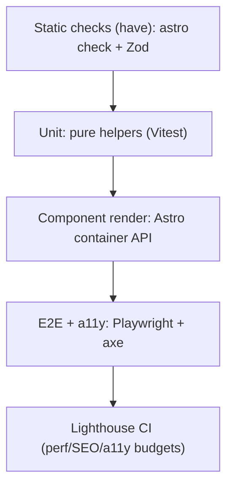

# 15 — Testing Strategy & Coverage

## Current state — honest assessment

**There are no automated tests in this repository.** Specifically:

- No test runner is installed (no Vitest, Jest, Playwright, etc. in `package.json`).
- No test files exist (no `*.test.ts`, `*.spec.ts`, `e2e/`, `__tests__/`).
- No coverage tooling or thresholds.

The **only automated quality gate today is static type-checking** via `astro check`, run as the
first half of `npm run build` (`package.json:9`). That catches:
- Type errors in `.astro` frontmatter, components, and `src/data/*.ts`.
- Prop-type mismatches.
- Indirectly, content-collection schema violations are caught at build by **Zod** (a build error,
  not a "test", but it is a real validation gate).

So effective coverage = **type safety + content-schema validation at build time**, and **0% runtime
test coverage**.

## What's low-risk vs. what's untested

| Area | Risk if it breaks | Currently guarded by |
| ---- | ----------------- | -------------------- |
| Content shape (projects) | Build fails | ✅ Zod schema |
| Data types | Build fails | ✅ `astro check` |
| Rendered HTML correctness | Visual/SEO regression | ❌ nothing |
| Theme toggle / persistence | UX bug | ❌ nothing |
| Scroll-reveal / scroll-spy | UX bug | ❌ nothing |
| Certificate carousel/lightbox | UX bug (most complex client logic) | ❌ nothing |
| Contact form submit + error paths | Lost leads | ❌ nothing |
| Accessibility | a11y regressions | ❌ nothing |

The riskiest untested logic is the **certificate carousel** (paging math, responsive `perView`,
resize handling — `Certifications.astro:111-185`) and the **contact form** (validation +
success/failure/network branches — `Contact.astro:96-151`).

## Recommended testing strategy

A pragmatic, low-overhead pyramid for a static site:



### 1. Unit tests (Vitest)
Extract and test pure logic:
- Carousel `maxIndex`/`perView`/index-wrap math (currently inline in the script — extract to a
  testable function first).
- Hero tagline splitting (`Hero.astro:5-7`).
- Any future formatting helpers.

### 2. Component/render tests
Use Astro's experimental container API to render a component to a string and assert on the HTML
(e.g. that `Projects` renders one `<article>` per collection entry, featured spans columns).

### 3. End-to-end (Playwright)
Highest value for this project — exercise the real built site:
- Theme toggle flips `.dark` and persists across reload.
- Nav anchors scroll to the right sections; scroll-spy highlights.
- Certificate lightbox opens/closes (button, backdrop, Escape).
- Contact form: empty-field validation; mock the Web3Forms endpoint and assert success/error
  status messages.

### 4. Accessibility tests
Integrate `@axe-core/playwright` into the E2E run; assert no critical violations on `/` in both
themes.

### 5. Lighthouse CI
Enforce budgets for Performance/SEO/Accessibility on the preview build in CI.

## Suggested minimal setup

```bash
npm i -D vitest @playwright/test @axe-core/playwright
```
```jsonc
// package.json scripts (proposed)
{
  "test": "vitest run",
  "test:e2e": "playwright test"
}
```
Then wire `npm run build` + tests into CI (see [14 — CI/CD](./14-build-deployment-cicd.md)).

## Manual test checklist (until automation exists)

Before each deploy, manually verify on `npm run preview`:

- [ ] Light/dark toggle works and persists after reload.
- [ ] All nav links scroll to the correct section; active link highlights.
- [ ] Mobile menu opens/closes and links close it.
- [ ] Hero typing animation runs (and is skipped under reduced motion).
- [ ] Project cards render; featured spans full width; repo/UI/demo links work.
- [ ] Certificate carousel pages on desktop/tablet/mobile widths; dots track; lightbox opens and
      closes via X / backdrop / Escape.
- [ ] Contact form: empty submit shows validation error; a real submit returns success.
- [ ] No console errors; page works with JS disabled (content visible).

See [Issues & Recommendations](./issues-and-recommendations.md) for the prioritised testing-gap
findings.
