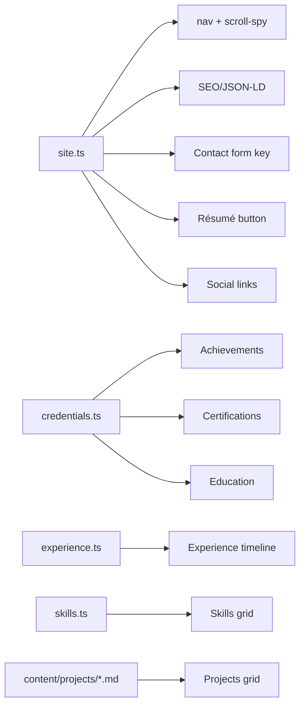

# 17 — Feature-wise Implementation Details

Each user-facing feature traced end-to-end through the actual code.

---

## Feature: Dark / Light theme

**Goal:** persistent theme with no flash on load.

| Step | Code |
| ---- | ---- |
| Define dark-mode variant | `global.css:6` `@custom-variant dark (&:where(.dark, .dark *))` |
| Apply saved theme pre-paint | `BaseLayout.astro:37-44` (head, before body) |
| Toggle + persist | `ThemeToggle.astro:16-24` |
| Icon swap | `ThemeToggle.astro:5-13` (sun in light, moon in dark via `dark:` classes) |
| Color-scheme hint | `global.css:50-55` |

**Flow:** head script reads `localStorage.theme` → adds `.dark` before paint → toggle button flips
the class and writes back. Light is the default; dark is opt-in.

---

## Feature: Single-page navigation + scroll-spy

**Goal:** anchor nav that highlights the section in view, plus a mobile menu.

| Step | Code |
| ---- | ---- |
| Nav data | `site.ts:52-60` (`navLinks`, `href: "#id"`) |
| Desktop nav render | `Header.astro:23-34` |
| Mobile menu render | `Header.astro:64-83` |
| Sticky/scrolled styling | `Header.astro:88-101` |
| Mobile toggle (ARIA + icons) | `Header.astro:104-119` |
| Scroll-spy | `Header.astro:121-145` (`IntersectionObserver`, band `-45%/-50%`) |
| Anchor offset | `global.css:58-59` (`scroll-padding-top`), `Section.astro:13` (`scroll-mt-24`) |

**Critical coupling:** `navLinks[].href` ids must equal section `id`s. Footer reuses the same
`navLinks` (`Footer.astro:2,35`).

---

## Feature: Scroll-reveal animations

| Step | Code |
| ---- | ---- |
| Mark elements | `data-reveal` attribute + optional `--reveal-delay` (e.g. `Projects.astro:26`) |
| Initial hidden state | `global.css:131-141` |
| Reveal on view | `BaseLayout.astro:69-90` (`IntersectionObserver` adds `.is-visible`, one-shot) |
| Reduced-motion / no-IO fallbacks | `BaseLayout.astro:71-76`, `global.css:143-159` |

---

## Feature: Hero typing effect

| Step | Code |
| ---- | ---- |
| Markup with `data-type-*` spans + cursor | `Hero.astro:55-58` |
| Tagline split for emphasis | `Hero.astro:5-7` |
| Cursor blink + ring animations | `Hero.astro:106-145` (scoped style) |
| Typewriter logic | `Hero.astro:147-176` (95ms/char; reduced-motion bail-out) |
| Profile image + initials fallback | `Hero.astro:23-32` (`onerror` swaps to "AG") |

---

## Feature: Projects (content-collection driven)

**Goal:** schema-validated project cards, featured ones full-width.

| Step | Code |
| ---- | ---- |
| Schema | `content.config.ts` (Zod) |
| Content files | `src/content/projects/*.md` |
| Fetch + sort | `Projects.astro:5` (`getCollection` → sort by `order` asc) |
| Featured full-width | `Projects.astro:23` (`p.data.featured && "lg:col-span-2"`) |
| Conditional links | `Projects.astro:51-88` (`github` / `githubUi` / `demo`) |
| Problem/Architecture panel | `Projects.astro:92-108` |
| Collapsible highlights | `Projects.astro:110-127` (`
`) |
| Tech chips | `Projects.astro:129-133` |

**Note:** Markdown bodies are authored but not rendered (only frontmatter is used). See
[06](./06-content-and-data-models.md).

---

## Feature: Experience timeline

| Step | Code |
| ---- | ---- |
| Data | `experience.ts` (`Role[]`) |
| Timeline spine | `Experience.astro:14` |
| Per-role node (green if `current`) | `Experience.astro:20-23` |
| "Current" chip | `Experience.astro:29-33` |
| Highlight cards (points + tech) | `Experience.astro:38-65` |

---

## Feature: Skills grid

| Step | Code |
| ---- | ---- |
| Data + icon map | `skills.ts` (`skillGroups`, private `ICONS`) |
| Card render | `Skills.astro:13-35` |
| Staggered reveal | `Skills.astro:18` (`--reveal-delay: i*60ms`) |

**Note:** `SkillGroup.id` is labelled a "filter id" but no filtering UI exists (dead capability).

---

## Feature: Achievements

| Step | Code |
| ---- | ---- |
| Data | `credentials.ts` (`achievements`, `kind` enum) |
| Kind → icon/label map | `Achievements.astro:5-10` |
| Card render | `Achievements.astro:20-37` |

---

## Feature: Certifications carousel + lightbox

**Goal:** responsive carousel of certificate images, click to enlarge.

| Step | Code |
| ---- | ---- |
| Data | `credentials.ts` (`certifications`, `image` paths) |
| Track + responsive card widths | `Certifications.astro:12-58` |
| Controls + dots | `Certifications.astro:61-84` |
| Lightbox markup (`role=dialog`) | `Certifications.astro:86-108` |
| Carousel engine (perView/maxIndex/dots/transform/resize) | `Certifications.astro:111-185` |
| Lightbox (open/close, scroll lock, Escape, backdrop) | `Certifications.astro:187-223` |

This is the most complex client-side feature — see
[09 — Client-Side Behaviour](./09-client-side-behavior.md#5-certificate-carousel--lightbox-certificationsastro111-223).

---

## Feature: Education

| Step | Code |
| ---- | ---- |
| Data | `credentials.ts` (`education`, with `logo` paths) |
| Card render (logo + score chip + period) | `Education.astro:8-45` |

---

## Feature: Contact form (Web3Forms)

**Goal:** accept messages without a backend.

| Step | Code |
| ---- | ---- |
| Headline + availability | `Contact.astro:8-26` |
| Form + honeypot + fields | `Contact.astro:29-92` |
| Key injection | `Contact.astro:96` (`define:vars`) |
| Validate → POST → status | `Contact.astro:110-149` |

Full sequence in [09](./09-client-side-behavior.md#6-contact-form-contactastro96-151) and
contract in [11](./11-apis-and-contracts.md#2-outbound-api-contract--web3forms).

---

## Feature: SEO & structured data

| Step | Code |
| ---- | ---- |
| Meta/OG/Twitter | `SEO.astro:44-62` |
| JSON-LD Person + WebSite | `SEO.astro:19-41,65-66` |
| Canonical/absolute URLs | `SEO.astro:16-17` |
| Sitemap | `astro.config.mjs:9` + `@astrojs/sitemap` |
| Robots | `public/robots.txt` |

---

## Feature: Résumé download

| Step | Code |
| ---- | ---- |
| Path | `site.ts:13` (`resumeUrl`) |
| Header button (desktop) | `Header.astro:37-47` (`download` attr) |
| Mobile menu button | `Header.astro:81` |
| File | `public/Akash-Gaur-Resume.pdf` |

---

## Cross-feature data dependency map

